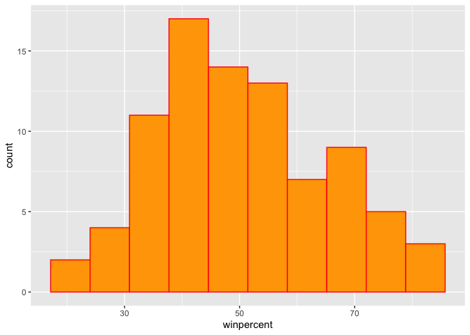
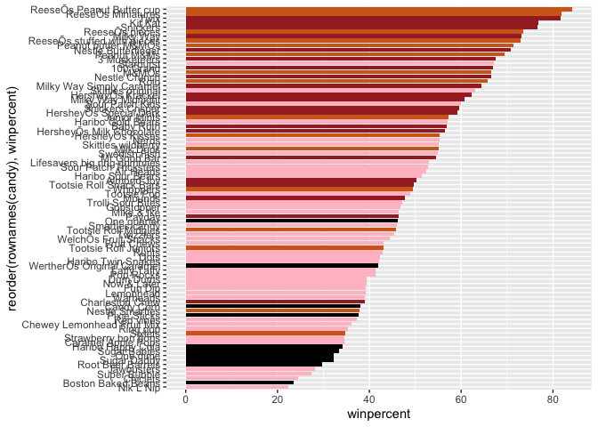
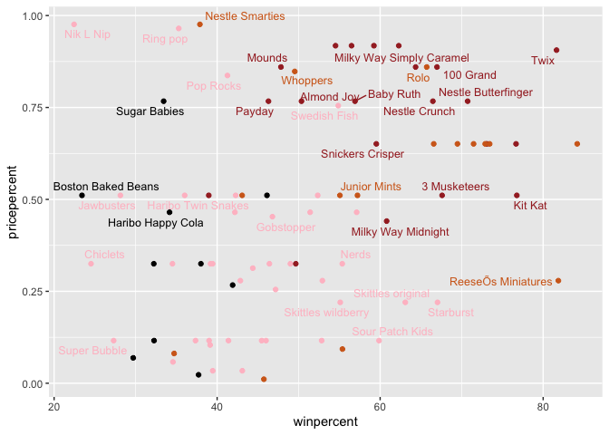
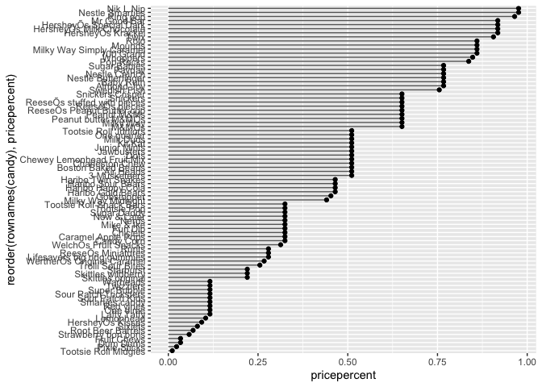
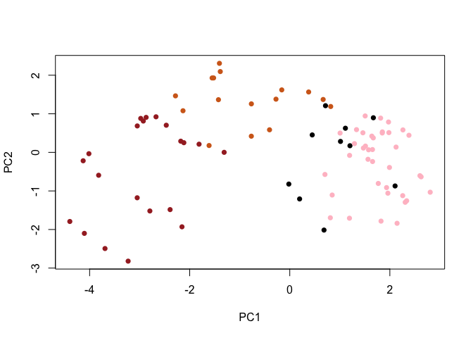
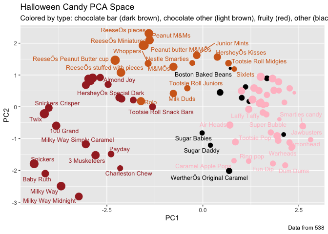
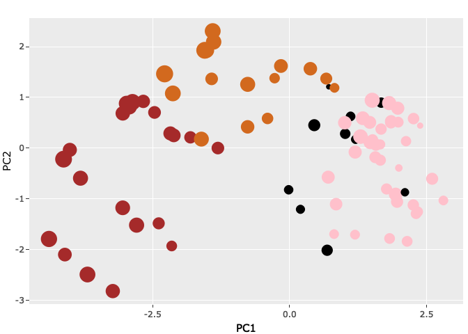

Class 10: Halloween Mini-Project
================
Kaitlyn Powell

``` r
library(webshot)
webshot::install_phantomjs()
```

    It seems that the version of `phantomjs` installed is greater than or equal to the requested version.To install the requested version or downgrade to another version, use `force = TRUE`.

## Background

Here we will analyze the 538 Candy data set in order to rank the
top-ranked snack size Halloween candy.

# 1. Importing candy data

Let’s get the data. I will download to my project directory…

``` r
candy_file <- "candy-data.csv"

candy = read.csv(candy_file, row.names=1)
head(candy)
```

                 chocolate fruity caramel peanutyalmondy nougat crispedricewafer
    100 Grand            1      0       1              0      0                1
    3 Musketeers         1      0       0              0      1                0
    One dime             0      0       0              0      0                0
    One quarter          0      0       0              0      0                0
    Air Heads            0      1       0              0      0                0
    Almond Joy           1      0       0              1      0                0
                 hard bar pluribus sugarpercent pricepercent winpercent
    100 Grand       0   1        0        0.732        0.860   66.97173
    3 Musketeers    0   1        0        0.604        0.511   67.60294
    One dime        0   0        0        0.011        0.116   32.26109
    One quarter     0   0        0        0.011        0.511   46.11650
    Air Heads       0   0        0        0.906        0.511   52.34146
    Almond Joy      0   1        0        0.465        0.767   50.34755

> Q1. How many different candy types are in this dataset?

There are 85 different candy types in this data set.

``` r
nrow(candy)
```

    [1] 85

> Q2. How many fruity candy types are in the dataset?

There are 38 fruity candy types in the data set.

``` r
sum(candy$fruity)
```

    [1] 38

# 2. What is your favorate candy?

\##Winpercent One of the most interesting variables in the dataset is
winpercent. For a given candy this value is the percentage of people who
prefer this candy over another randomly chosen candy.

``` r
candy["Twix", ]$winpercent
```

    [1] 81.64291

> Q3. What is your favorite candy in the dataset and what is it’s
> winpercent value?

My favorite candy in the dataset is Swedish Fish and it’s winpercent is
54.86111%.

``` r
rownames(candy)
```

     [1] "100 Grand"                   "3 Musketeers"               
     [3] "One dime"                    "One quarter"                
     [5] "Air Heads"                   "Almond Joy"                 
     [7] "Baby Ruth"                   "Boston Baked Beans"         
     [9] "Candy Corn"                  "Caramel Apple Pops"         
    [11] "Charleston Chew"             "Chewey Lemonhead Fruit Mix" 
    [13] "Chiclets"                    "Dots"                       
    [15] "Dum Dums"                    "Fruit Chews"                
    [17] "Fun Dip"                     "Gobstopper"                 
    [19] "Haribo Gold Bears"           "Haribo Happy Cola"          
    [21] "Haribo Sour Bears"           "Haribo Twin Snakes"         
    [23] "HersheyÕs Kisses"            "HersheyÕs Krackel"          
    [25] "HersheyÕs Milk Chocolate"    "HersheyÕs Special Dark"     
    [27] "Jawbusters"                  "Junior Mints"               
    [29] "Kit Kat"                     "Laffy Taffy"                
    [31] "Lemonhead"                   "Lifesavers big ring gummies"
    [33] "Peanut butter M&MÕs"         "M&MÕs"                      
    [35] "Mike & Ike"                  "Milk Duds"                  
    [37] "Milky Way"                   "Milky Way Midnight"         
    [39] "Milky Way Simply Caramel"    "Mounds"                     
    [41] "Mr Good Bar"                 "Nerds"                      
    [43] "Nestle Butterfinger"         "Nestle Crunch"              
    [45] "Nik L Nip"                   "Now & Later"                
    [47] "Payday"                      "Peanut M&Ms"                
    [49] "Pixie Sticks"                "Pop Rocks"                  
    [51] "Red vines"                   "ReeseÕs Miniatures"         
    [53] "ReeseÕs Peanut Butter cup"   "ReeseÕs pieces"             
    [55] "ReeseÕs stuffed with pieces" "Ring pop"                   
    [57] "Rolo"                        "Root Beer Barrels"          
    [59] "Runts"                       "Sixlets"                    
    [61] "Skittles original"           "Skittles wildberry"         
    [63] "Nestle Smarties"             "Smarties candy"             
    [65] "Snickers"                    "Snickers Crisper"           
    [67] "Sour Patch Kids"             "Sour Patch Tricksters"      
    [69] "Starburst"                   "Strawberry bon bons"        
    [71] "Sugar Babies"                "Sugar Daddy"                
    [73] "Super Bubble"                "Swedish Fish"               
    [75] "Tootsie Pop"                 "Tootsie Roll Juniors"       
    [77] "Tootsie Roll Midgies"        "Tootsie Roll Snack Bars"    
    [79] "Trolli Sour Bites"           "Twix"                       
    [81] "Twizzlers"                   "Warheads"                   
    [83] "WelchÕs Fruit Snacks"        "WertherÕs Original Caramel" 
    [85] "Whoppers"                   

``` r
candy["Swedish Fish",]
```

                 chocolate fruity caramel peanutyalmondy nougat crispedricewafer
    Swedish Fish         0      1       0              0      0                0
                 hard bar pluribus sugarpercent pricepercent winpercent
    Swedish Fish    0   0        1        0.604        0.755   54.86111

> Q4. What is the winpercent value for “Kit Kat”?

The winpercent value for “Kit Kat” is 76.7686%.

``` r
candy["Kit Kat",]
```

            chocolate fruity caramel peanutyalmondy nougat crispedricewafer hard
    Kit Kat         1      0       0              0      0                1    0
            bar pluribus sugarpercent pricepercent winpercent
    Kit Kat   1        0        0.313        0.511    76.7686

> Q5. What is the winpercent value for “Tootsie Roll Snack Bars”?

The winpercent value for “Tootsie Roll Snack Bars” is 49.6535%.

``` r
candy["Tootsie Roll Snack Bars",]
```

                            chocolate fruity caramel peanutyalmondy nougat
    Tootsie Roll Snack Bars         1      0       0              0      0
                            crispedricewafer hard bar pluribus sugarpercent
    Tootsie Roll Snack Bars                0    0   1        0        0.465
                            pricepercent winpercent
    Tootsie Roll Snack Bars        0.325    49.6535

## A useful function from the skimr package

Side-note: the `skimr::skim()` function is a useful package that can
help give you a quick overview of a given data set. Let’s install this
package and try it on our candy data.

``` r
skimr::skim(candy)
```

|                                                  |       |
|:-------------------------------------------------|:------|
| Name                                             | candy |
| Number of rows                                   | 85    |
| Number of columns                                | 12    |
| \_\_\_\_\_\_\_\_\_\_\_\_\_\_\_\_\_\_\_\_\_\_\_   |       |
| Column type frequency:                           |       |
| numeric                                          | 12    |
| \_\_\_\_\_\_\_\_\_\_\_\_\_\_\_\_\_\_\_\_\_\_\_\_ |       |
| Group variables                                  | None  |

Data summary

**Variable type: numeric**

| skim_variable    | n_missing | complete_rate |  mean |    sd |    p0 |   p25 |   p50 |   p75 |  p100 | hist  |
|:-----------------|----------:|--------------:|------:|------:|------:|------:|------:|------:|------:|:------|
| chocolate        |         0 |             1 |  0.44 |  0.50 |  0.00 |  0.00 |  0.00 |  1.00 |  1.00 | ▇▁▁▁▆ |
| fruity           |         0 |             1 |  0.45 |  0.50 |  0.00 |  0.00 |  0.00 |  1.00 |  1.00 | ▇▁▁▁▆ |
| caramel          |         0 |             1 |  0.16 |  0.37 |  0.00 |  0.00 |  0.00 |  0.00 |  1.00 | ▇▁▁▁▂ |
| peanutyalmondy   |         0 |             1 |  0.16 |  0.37 |  0.00 |  0.00 |  0.00 |  0.00 |  1.00 | ▇▁▁▁▂ |
| nougat           |         0 |             1 |  0.08 |  0.28 |  0.00 |  0.00 |  0.00 |  0.00 |  1.00 | ▇▁▁▁▁ |
| crispedricewafer |         0 |             1 |  0.08 |  0.28 |  0.00 |  0.00 |  0.00 |  0.00 |  1.00 | ▇▁▁▁▁ |
| hard             |         0 |             1 |  0.18 |  0.38 |  0.00 |  0.00 |  0.00 |  0.00 |  1.00 | ▇▁▁▁▂ |
| bar              |         0 |             1 |  0.25 |  0.43 |  0.00 |  0.00 |  0.00 |  0.00 |  1.00 | ▇▁▁▁▂ |
| pluribus         |         0 |             1 |  0.52 |  0.50 |  0.00 |  0.00 |  1.00 |  1.00 |  1.00 | ▇▁▁▁▇ |
| sugarpercent     |         0 |             1 |  0.48 |  0.28 |  0.01 |  0.22 |  0.47 |  0.73 |  0.99 | ▇▇▇▇▆ |
| pricepercent     |         0 |             1 |  0.47 |  0.29 |  0.01 |  0.26 |  0.47 |  0.65 |  0.98 | ▇▇▇▇▆ |
| winpercent       |         0 |             1 | 50.32 | 14.71 | 22.45 | 39.14 | 47.83 | 59.86 | 84.18 | ▃▇▆▅▂ |

> Q6. Is there any variable/column that looks to be on a different scale
> to the majority of the other columns in the dataset?

The winpercent variable seems to be on a different scale to the majority
of the other columns in the data set. The values in this row appear to
have much higher values than the other rows.

> Q7. What do you think a zero and one represent for the
> candy\$chocolate column?

I think that the zero in the `candy$chocolate` column means that a given
candy (shown in the rows) is not chocolate. Alternatively, a one in the
`candy$chocolate` column means that a given candy is chocolate.

> Q8. Plot a histogram of winpercent values

The histogram showing winpercent values is shown below:

``` r
hist(candy$winpercent)
```


``` r
library(ggplot2)

ggplot(candy) +
  aes(winpercent) +
  geom_histogram(bins = 10,  col="red", fill="orange")
```



> Q9. Is the distribution of winpercent values symmetrical?

The distribution of the winpercent values does not appear to be
symmetrical. It seems to be skewed to the right.

> Q10. Is the center of the distribution above or below 50%?

The center of the distribution is slightly above 50%.

mean(winpercent)

``` r
mean(candy$winpercent)
```

    [1] 50.31676

> Q11. On average is chocolate candy higher or lower ranked than fruit
> candy?

On average, chocolate candy is ranked higher than fruity candy.

``` r
chocolate.inds <- as.logical(candy$chocolate)
chocolate.wins <- candy[chocolate.inds,]$winpercent
mean(chocolate.wins)
```

    [1] 60.92153

``` r
fruity.inds <- as.logical(candy$fruity)
fruity.wins <- candy[fruity.inds,]$winpercent
mean(fruity.wins)
```

    [1] 44.11974

> Q12. Is this difference statistically significant?

The difference is statistically significant, as shown by having such a
small p-value when conducting a t-test for chocolate and fruity candy.

``` r
t.test(chocolate.wins, fruity.wins)
```


        Welch Two Sample t-test

    data:  chocolate.wins and fruity.wins
    t = 6.2582, df = 68.882, p-value = 2.871e-08
    alternative hypothesis: true difference in means is not equal to 0
    95 percent confidence interval:
     11.44563 22.15795
    sample estimates:
    mean of x mean of y 
     60.92153  44.11974 

# 3. Overall Candy Rankings

Let’s use the base `R order()` function together with head() to sort the
whole dataset by winpercent.

> Q13. What are the five least liked candy types in this set?

The five least liked candy types in this set are Nik L Nip, Boston Baked
Beans, Chiclets, Super Bubble, and Jawbusters.

``` r
head(candy[order(candy$winpercent),], n=5)
```

                       chocolate fruity caramel peanutyalmondy nougat
    Nik L Nip                  0      1       0              0      0
    Boston Baked Beans         0      0       0              1      0
    Chiclets                   0      1       0              0      0
    Super Bubble               0      1       0              0      0
    Jawbusters                 0      1       0              0      0
                       crispedricewafer hard bar pluribus sugarpercent pricepercent
    Nik L Nip                         0    0   0        1        0.197        0.976
    Boston Baked Beans                0    0   0        1        0.313        0.511
    Chiclets                          0    0   0        1        0.046        0.325
    Super Bubble                      0    0   0        0        0.162        0.116
    Jawbusters                        0    1   0        1        0.093        0.511
                       winpercent
    Nik L Nip            22.44534
    Boston Baked Beans   23.41782
    Chiclets             24.52499
    Super Bubble         27.30386
    Jawbusters           28.12744

> Q14. What are the top 5 all time favorite candy types out of this set?

The top five all time favorite candy types in this data set are
Snickers, Kit Kat, Twix, ReeseOs Miniatures, and ReeseOs Peanut Butter
cup.

``` r
tail(candy[order(candy$winpercent),], n=5)
```

                              chocolate fruity caramel peanutyalmondy nougat
    Snickers                          1      0       1              1      1
    Kit Kat                           1      0       0              0      0
    Twix                              1      0       1              0      0
    ReeseÕs Miniatures                1      0       0              1      0
    ReeseÕs Peanut Butter cup         1      0       0              1      0
                              crispedricewafer hard bar pluribus sugarpercent
    Snickers                                 0    0   1        0        0.546
    Kit Kat                                  1    0   1        0        0.313
    Twix                                     1    0   1        0        0.546
    ReeseÕs Miniatures                       0    0   0        0        0.034
    ReeseÕs Peanut Butter cup                0    0   0        0        0.720
                              pricepercent winpercent
    Snickers                         0.651   76.67378
    Kit Kat                          0.511   76.76860
    Twix                             0.906   81.64291
    ReeseÕs Miniatures               0.279   81.86626
    ReeseÕs Peanut Butter cup        0.651   84.18029

> Q15. Make a first barplot of candy ranking based on winpercent values.

The first barplot of candy ranking based on winpercent values is shown
below:

``` r
library(ggplot2)

ggplot(candy) + 
  aes(winpercent, rownames(candy)) +
  geom_col()
```


> Q16. This is quite ugly, use the reorder() function to get the bars
> sorted by winpercent?

The plot below shows the plot with the bars sorted by winpercent using
the `reorder()` fucntion.

``` r
library(ggplot2)

ggplot(candy) + 
  aes(winpercent, reorder(rownames(candy), winpercent)) +
  geom_col()
```


First setup some colors for different candy types.

``` r
my_cols=rep("black", nrow(candy))
my_cols[as.logical(candy$chocolate)] = "chocolate"
my_cols[as.logical(candy$bar)] = "brown"
my_cols[as.logical(candy$fruity)] = "pink"
#my_cols
```

``` r
ggplot(candy) + 
  aes(winpercent, reorder(rownames(candy),winpercent)) +
  geom_col(fill=my_cols) 
```



``` r
ggsave("tmp.png")
```

    Saving 7 x 5 in image

Now, for the first time, using this plot we can answer questions like:

> Q17. What is the worst ranked chocolate candy?

The wosrt ranked chocolate candy is Sixlets.

> Q18. What is the best ranked fruity candy?

The best ranked fruity candy is Starburst.

# 4. Taking a look at pricepercent

What is the best (most liked in terms of `winpercent`) for the money (in
terms of `pricepercent`)?

To answer this I will make a plot of winpercent vs pricepercent.

``` r
library(ggrepel)

# How about a plot of price vs win
ggplot(candy) +
  aes(winpercent, pricepercent, label=rownames(candy)) +
  geom_point(col=my_cols) + 
  geom_text_repel(col=my_cols, size=3.3, max.overlaps = 5)
```

    Warning: ggrepel: 50 unlabeled data points (too many overlaps). Consider
    increasing max.overlaps



> Q19. Which candy type is the highest ranked in terms of winpercent for
> the least money - i.e. offers the most bang for your buck?

ReeseOs Miniatures are the highest raned in terms of winpercent for the
least money, they offer the most bang for your buck.

> Q20. What are the top 5 most expensive candy types in the dataset and
> of these which is the least popular?

The top five most expensive candy types in the data set are Nik L Nip,
Nestle Smarties, Ring pop, HersheyOs Krackel, HersheyOs Milk Chocolate.
The least popular of these candies is Nik L Nip.

``` r
ord <- order(candy$pricepercent, decreasing = TRUE)
head( candy[ord,c(11,12)], n=5 )
```

                             pricepercent winpercent
    Nik L Nip                       0.976   22.44534
    Nestle Smarties                 0.976   37.88719
    Ring pop                        0.965   35.29076
    HersheyÕs Krackel               0.918   62.28448
    HersheyÕs Milk Chocolate        0.918   56.49050

> Q21. Make a barplot again with geom_col() this time using pricepercent
> and then improve this step by step, first ordering the x-axis by value
> and finally making a so called “dot chat” or “lollipop” chart by
> swapping geom_col() for geom_point() + geom_segment().

The barplot with the features mentioned in the question is shown below:

``` r
library(ggplot2)

ggplot(candy) + 
  aes(pricepercent, reorder(rownames(candy), winpercent)) +
  geom_col()
```


``` r
# Make a lollipop chart of pricepercent
ggplot(candy) +
  aes(pricepercent, reorder(rownames(candy), pricepercent)) +
  geom_segment(aes(yend = reorder(rownames(candy), pricepercent), 
                   xend = 0), col="gray40") +
    geom_point()
```



# 5. Exploring the correlation structure

Now that we’ve explored the dataset a little, we’ll see how the
variables interact with one another. We’ll use correlation and view the
results with the corrplot package to plot a correlation matrix.

``` r
library(corrplot)
```

    corrplot 0.92 loaded

``` r
cij <- cor(candy)
corrplot(cij)
```


> Q22. Examining this plot what two variables are anti-correlated
> (i.e. have minus values)?

The two variables that are anti-correlated are chocolate and fruity.

> Q23. Similarly, what two variables are most positively correlated?

The two variables that are most positively correlated are winpercent and
chocolate.

# 6. Principal Component Analysis

Let’s apply PCA using the `prcom()` function to our candy dataset
remembering to set the `scale=TRUE` argument.

``` r
pca <- prcomp(candy, scale = TRUE)
summary(pca)
```

    Importance of components:
                              PC1    PC2    PC3     PC4    PC5     PC6     PC7
    Standard deviation     2.0788 1.1378 1.1092 1.07533 0.9518 0.81923 0.81530
    Proportion of Variance 0.3601 0.1079 0.1025 0.09636 0.0755 0.05593 0.05539
    Cumulative Proportion  0.3601 0.4680 0.5705 0.66688 0.7424 0.79830 0.85369
                               PC8     PC9    PC10    PC11    PC12
    Standard deviation     0.74530 0.67824 0.62349 0.43974 0.39760
    Proportion of Variance 0.04629 0.03833 0.03239 0.01611 0.01317
    Cumulative Proportion  0.89998 0.93832 0.97071 0.98683 1.00000

Now we can plot our main PCA score plot of PC1 vs PC2.

``` r
plot(pca$x[,1:2])
```


We can change the plotting character and add some color:

``` r
plot(pca$x[,1:2], col=my_cols, pch=16)
```



## Make a new data-frame with our PCA results and candy data

``` r
my_data <- cbind(candy, pca$x[,1:3])
```

``` r
p <- ggplot(my_data) + 
        aes(x=PC1, y=PC2, 
            size=winpercent/100,  
            text=rownames(my_data),
            label=rownames(my_data)) +
        geom_point(col=my_cols)

p
```


``` r
library(ggrepel)

p + geom_text_repel(size=3.3, col=my_cols, max.overlaps = 7)  + 
  theme(legend.position = "none") +
  labs(title="Halloween Candy PCA Space",
       subtitle="Colored by type: chocolate bar (dark brown), chocolate other (light brown), fruity (red), other (black)",
       caption="Data from 538")
```

    Warning: ggrepel: 39 unlabeled data points (too many overlaps). Consider
    increasing max.overlaps



more candy labels you can change the `max.overlaps` value to allow more
overlapping labels or pass the ggplot object p to plotly like so to
generate an interactive plot that you can mouse over to see labels:

``` r
library(plotly)
```


    Attaching package: 'plotly'

    The following object is masked from 'package:ggplot2':

        last_plot

    The following object is masked from 'package:stats':

        filter

    The following object is masked from 'package:graphics':

        layout

``` r
ggplotly(p)
```



Let’s finish by taking a quick look at PCA our loadings.

``` r
par(mar=c(8,4,2,2))
barplot(pca$rotation[,1], las=2, ylab="PC1 Contribution")
```


> Q24. What original variables are picked up strongly by PC1 in the
> positive direction? Do these make sense to you?

The original variables that are picked up strongly by PC1 in the
positive direction are fruity, hard, and pluribus. This does make sense
since most fruity candies possess the characteristics of being hard and
pluribus.
